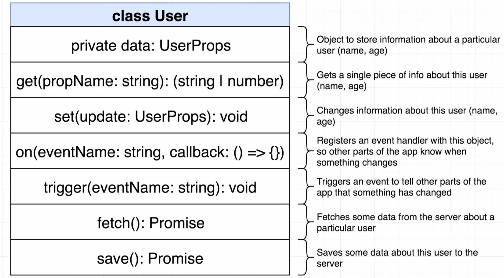
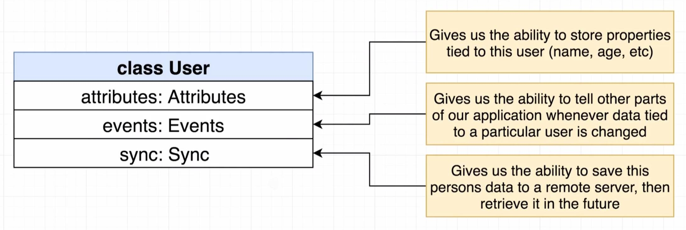

# 开始

## 安装

`npm install -g typescript ts-node`

## setup

`npm init -y`

编译 ts 文件：`tsc index.ts` 生成 js 文件

编译并执行 ts 文件：`ts-node index.ts`

_可能报错_:`error TS2584: Cannot find name 'console'.`

解决：安装@type/node `pnpm install @types/node --save-dev`

> typescript 作用：通过定义变量类型，帮助我们在编程时检验对变量的操作是否有错误

> 编写代码时可能的错误：

- 对象属性访问错误
- 调用函数是参数输入错误
# 基础
## 类型

> 什么是类型？

用来描述变量可以拥有的属性和方法。例如声明一个变量为 string，则这个变量拥有 string 的所有属性和方法。

> 为什么要关心类型

1. ts 编译器使用 types 来分析代码中是否有错误

2. 标记变量的类型，有助于理解代码

## 特性

typescript 可以通过类型推论提供类型。TypeScript 编辑器可以通过分析代码，推断出变量和方法的类型，并在输入代码时提供相关的代码提示。

## 类型注释

为变量注释类型后，不能赋值其他类型

> 什么时候需要类型注释？

_个人认为是在类型推论失效时；或者是自动推论的结果有误时手动声明类型_

- 出现 any 类型时（使用函数等）
- 声明变量时不立即赋值

### 函数的类型注释

告诉 ts 函数接受的参数类型和返回值类型

- 函数参数类型 必须声明
- 返回值

  类型推论可以判断函数返回值，但我们仍需要声明返回类型：因为我们很容易在编写函数时出现逻辑错误，忘记或错误返回值

### 对象的类型注释

对象内可以声明多个不同类型的变量

## 类型推论

ts 在没有明确指出类型的地方，类型推论会提供类型。
类型推论发生在：

- 初始化变量和成员（同一行）
- 设置默认参数值
- 决定函数返回值

### 函数的类型推论

尝试推断函数的返回值

### 解构

**用于对象：**

- 可以直接解构
  `const {a} = o；`
- 指定类型
  `const { age }: { age: number } = profile;`
- 属性重命名
  `let {a:newName1,b:newName2}=o`
- 结构嵌套属性

```typescript
const {
  coords: { lat, lng },
}: { coords: { lat: number; lng: number } } = profile;
```

**用于函数声明：**

```typescript
type C = { a: string; b?: number };
function f({ a, b }: C): void {}
```

<span style="color:red">ts
只检查类型，不检查逻辑</span>

### 最佳通用类型

当需要从几个表达式中推断类型时候，会使用这些表达式的类型来推断出一个最合适的通用类型。

如果没有找到最佳通用类型的话，我们可以明确指出类型；或者自动推断为联合数组类型

### 联合类型

当变量可能赋值的类型不止一个时，类型推论失效，使用联合类型注释：
`numberAboveZero:number | boolean`

## any 类型

使用`any`为编程阶段不确定类型的变量指定类型。这些值可能来自于动态的内容，比如来自用户输入或第三方代码库。 这种情况下，我们不希望类型检查器对这些值进行检查而是直接让它们通过编译阶段的检查。

但是对于这些变量，ts 无法检验到错误，需要认为指定。

## 数组

- 当我们从数组中获取元素时进行类型推断
- 防止我们向数组中添加不兼容的值
- 在使用 map、forEach 等函数时 ts 推断出参数类型
- 可以包含多种类型的元素
  - 使用联合类型

## 元组

表示一个已知元素数量和类型的数组

```typescript
// Declare a tuple type
type Drink = [string, number];
// Initialize it
let x: Drink = ["hello", 10]; // OK
```

当访问一个已知索引的元素，会得到正确的类型,但不怎么使用 😂

## 接口

接口+类->代码重用

接口：规定对象中的属性和类型。

当函数需要接受一个对象做参数时，可以为对象定义一个接口。
```
interface Vehicle {
   name: string;
   year: Date;
   broken: boolean;
   summary(): string;
}
```

**进阶** 

将对对象的操作定义为对象方法后，可以在对象内部操作属性，那么接口可以省略定义其他属性，把对象方法抽出成接口就可以重用。
```
interface Reportable {
  summary(): string;
}
```

🦆：接口只检查传入对象是否有规定的属性，不会限制对象的额外属性；但传入对象字面量就会严格检查，不能有额外属性。

可以把相同返回值类型的对象函数抽象成一个接口，可重用：可以接受任何包含某个函数的对象。

## 类 Class

创建对象的蓝图
```typescript
class Vehicle {
  constructor(public color: string) {}
  
  protected honk(): void {
    console.log('beep');
  }
  private beep(): void {
    console.log('beep');
  }
}
```
继承
```typescript
  class Car extends Vehicle {
    constructor(public wheels: number, color: string) {
      super(color);
    }
  
    private drive(): void {
      console.log('vroom');
    }
  }
```
## 泛型
T作为类型的占位符

类型：
```typescript
class ArrayOfAnything<T> {
  constructor(public collection: T[]) {}

  get(index: number): T {
    return this.collection[index];
  }
}
```

函数：
```typescript
function printAnything<T>(arr: T[]): void {
  for (let i = 0; i < arr.length; i++) {
    console.log(arr[i]);
  }
}
```

泛型约束：

通过继承接口来约束泛型内要实现某些属性或方法
```typescript
function printHousesOrCars<T extends Printable>(arr: T[]): void {
  for (let i = 0; i < arr.length; i++) {
    arr[i].print();
  }
}
```

# 第一个app
面向对象，为每个对象创建一个类

**当对象类型不同，但有相同操作时**，我们可以将共同具有的属性和方法抽出，定义一个接口，让每个类实现这个抽象类。这样就可以使传入的参数类型一致从而复用代码。

`implements`关键字是实现，使用 接口只定义了类型

例如User和Company在地图上显示坐标的时候都只需要用到坐标和markerContent()方法。
```typescript
export interface Mappable{
    location:{
        lat:number;
        lng:number;
    };
    markerContent():string;
}
    addMarker(mappable:Mappable):void{
        const marker = new BMapGL.Marker(new BMapGL.Point(mappable.location.lng,mappable.location.lat));
        this.BMap.addOverlay(marker);  
        marker.addEventListener("click",function(){
            alert(mappable.markerContent());
        
        });
    }
```
# 排序app
添加tsconfig.json: `tsc --init`

在`tsconfig.json`文件内设置rootDir和outDir，命令行运行`tsc`命令就会自动读取对应目录下的ts文件，并将js文件输出到指定目录

`tsc -w`每次修改自动编译保存
安装 concurrently nodemon 包，实现修改后自动的编译运行

```
  "start:built": "tsc -w",
  "start:run": "nodemon built/index.js",
  "start": "concurrently npm:start:*"
```
**对象不同，方法类似**
将不同对象里的相同方法逻辑抽象成一个抽象类，不同对象通过继承抽象类，在自己类内部定义自己的具体处理逻辑；

接口是把对象中相同的属性抽出来作为接口，保证实现的对象被都有这些属性

例如对数字、字符串、链表进行排序，可以使用相同的排序算法，但由于操作对象不同，排序算法内部的实现细节不一致。这时就可以抽出不同的方法，例如：比较、交换，定义为抽象方法，让操作对象在继承时重写。

`extends`关键字是继承，子类可以重写父类定义的方法，也可以使用。

```typescript
export abstract class Sorter{
    abstract compare(leftIndex: number, rightIndex: number): boolean;
    abstract swap(leftIndex: number, rightIndex: number): void;
    abstract length: number;
    sort(): void{
        const { length } = this;
        for(let i = 0; i < length; i++){
            for(let j = 0; j < length - i - 1; j++){
               if(this.compare(j, j + 1)){
                   this.swap(j, j + 1);
               }
            }
        }
    }
}
```
# 分析csv文件
需求：整体分为读取文件和分析文件数据并输出

1. 读取文件类型需要多样

把从不同文件读数据的方法read()和存储的数据封装为接口。之后新增别的类型的只需要实现这个类就可以。
```typescript
export interface DataReader{
    data:string[][],
    read():void
}
```

2. 读取数据后还要存储，需要定义存储的数据类型

这其中还使用了枚举、type

```typescript
export enum MatchResult {
    HomeWin = 'H',
    AwayWin = 'A',
    Draw = 'D'
}
export type MatchData=[
    Date,
    string,
    string,
    number,
    number,
    MatchResult,
    string
]
```

3. 数据分析也可能会有多种方法

将数据分析的方法封装为接口

```typescript
export interface Analyzer{
    run(matches:MatchData[]):string
}
```

4. 输出也可能有多种不同形式

将输出的print方法封装成接口
```typescript
export interface OutputTarget{
    print(output:string):void
}
```

4. 运行数据分析并输出

作为Summary类的方法

```typescript
buildAndPrintReport(matches:MatchData[]){
  const output=this.analyzer.run(matches)
  this.outputTarget.print(output)
}
```
# web框架
整体思路：

先构建拥有大量方法的User类->使用组合重构User类->重构User类使其成为一个可重用的类，可以表示其他数据



## 构建User类
### on
在对象上注册事件。使用Map存储，事件名作为key，注册的回调函数存储在数组中作为值

### trigger
调用在User上注册的事件

### fetch和save
使用json-server保存数据,使用axios获取数据
安装json-server
`npm install -g json-server`

`json-server -w db.json`运行一个服务器，通过给出的地址将db.json文件作为数据库，使用axios进行操作。

## 重构User类
将User类分为三个部分：
- 存储与用户相关的数据
- 负责事件逻辑
- 处理数据持久性
目标：将User类中的大量方法拆分，通过组合的方式作为User类的属性进行操作。

### 事件类
可能的解决方法：
1. 直接在构造器中引入依赖 ❌每次创建User时还需要创建一个事件类
2. 将创建事件类部分定义为一个类作为预配制类，仍然直接在构造器中引入依赖，但使用静态方法在内部使用预配制类构建对象。
例如：

```typescript
interface DataReader{
    read():void;
    data:string[][];
}

export class MatchReader{
    static fromCsv(filename:string):MatchReader{
        return new MatchReader(new CsvFileReader(filename));
    }
    constructor(public reader:DataReader){}
}
```
  将read()读取数据的方法分离，使用CsvFileReader类读取数据；使用fromCsv静态方法new CsvFileReader类。

  👎缺点：
  - 预配制初始化繁琐
  -  如果不使用CsvFileReader类，还需要复制代码再写一个静态方法（这也是好处👍，预配制类可以灵活更换，视具体情况判断）


3. 事件类作为属性，每次new User类时，默认创建

### Sync类
Sync类中有sava和fetch方法，需要使用User类中的数据

方法：

1. 通过方法参数传递 ❌Sync类与User类高度绑定
2. Serialize和Deserialize 
Serialize：从对象转化为可存储的形式（json）

Deserialize:解析json数据为对象

（提取传递参数中共有的属性为**接口**）

3. 定义Sync为一个泛型类

使用泛型约束,将需要的T的属性作为接口由T继承

```typescript
interface HasId{
    id?:number;
}
export class Sync<T extends HasId>{
    constructor(public rootUrl:string){}
    save(data:T):AxiosPromise{
        const { id }=data;
        if(id){
            return axios.put(`${this.rootUrl}/${id}`,data)
        }else{
            return axios.post(this.rootUrl,data)
        }
    }
}
```
### Attributes类
泛型约束升级：

获取泛型中的属性

```typescript
get<K extends keyof T>(key:K):T[K]{
  return this.data[key];
}
```
### 组合 使用get获取方法
使用get 将分布在各个组件里的方法返回给User类，使得可以直接在user实例上调用。

但要注意`this`，返回到user里的`this`指的就是当前的user实例，可以使用箭头函数。

## 从User类中提取可重用的类
在Model.ts中为注入的依赖定义接口，提取出User类中定义好的方法作为亲类。之后不同的类可以继承Model。

继承时，在子类new 需要的依赖，定义静态方法进行实例化